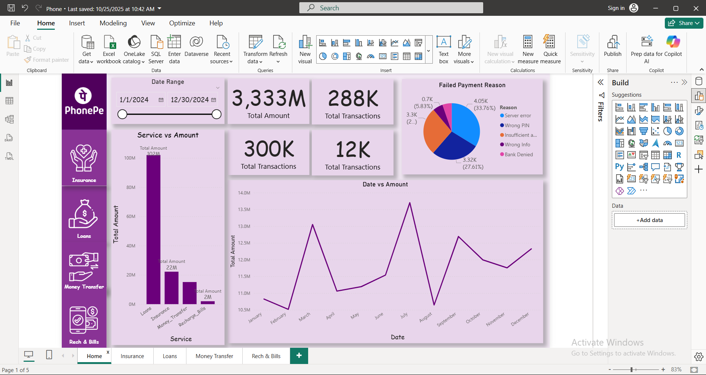
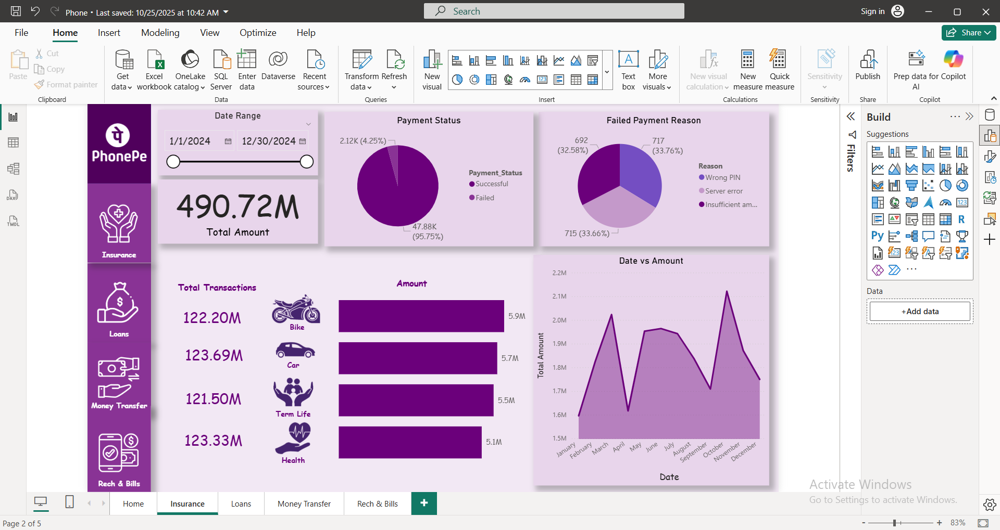
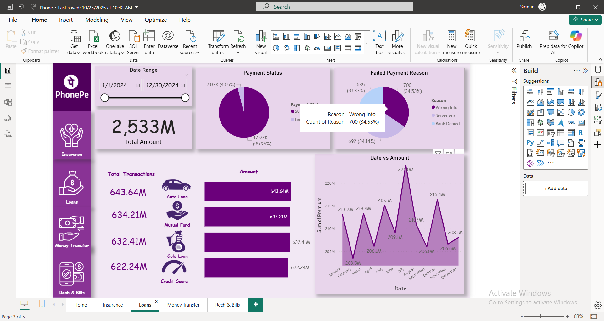
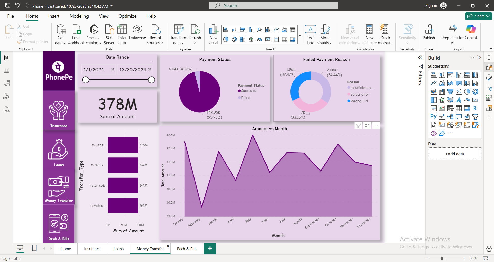
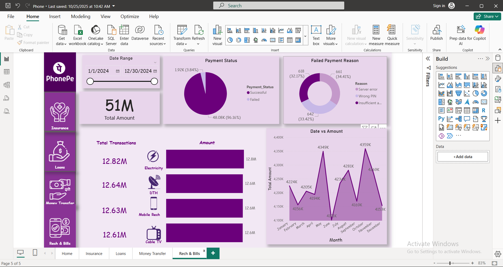

# 📊 PhonePe Data Analysis Dashboard (Power BI)

## 📘 Project Overview  
This Power BI project provides a **comprehensive analysis of PhonePe transaction data** for the year **20XX**. It offers insights into multiple service categories such as **Insurance, Loans, Money Transfer, and Recharge & Bills**.  

The dashboard is designed to visualize transaction amounts, payment success/failure rates, and failure reasons, helping stakeholders understand business performance and trends across various services.

---

## 🎯 Objectives  
- Analyze total transaction amounts and volume across services.  
- Compare monthly transaction trends.  
- Identify and visualize **failed payment reasons** (e.g., server error, wrong PIN, insufficient balance, etc.).  
- Evaluate **payment success rate** across all categories.  
- Provide an interactive and visual summary of PhonePe’s digital payment data.

---

## 🧩 Dashboard Pages  

### 1️⃣ Home Dashboard  
- Displays overall **total amount** and **total transactions**.  
- Shows breakdown by service type (Loans, Insurance, Money Transfer, Recharge & Bills).  
- Line chart representing **Date vs Amount** trend.  
- Pie chart for **Failed Payment Reasons**.  



---

### 2️⃣ Insurance Dashboard  
- Visualizes total amount and transactions for different insurance types (Bike, Car, Term Life, Health).  
- Payment status breakdown (Successful vs Failed).  
- Pie chart showing **Failure Reasons**.  
- Monthly performance trend (Date vs Amount).  



---

### 3️⃣ Loans Dashboard  
- Displays total amount and transactions for loan categories: **Auto Loan, Mutual Fund, Gold Loan, Credit Score**.  
- Pie chart showing failed payment reasons.  
- Line graph showing **Date vs Amount** trend for loan transactions.  



---

### 4️⃣ Money Transfer Dashboard  
- Tracks total amount transferred via UPI ID, Self Account, QR Code, and Mobile Number.  
- Compares successful vs failed payments.  
- Monthly transaction performance visualization.  



---

### 5️⃣ Recharge & Bills Dashboard  
- Visualizes total transactions and amounts for categories like **Electricity, DTH, Mobile Recharge, and Cable TV**.  
- Highlights **payment success/failure ratio**.  
- Line chart for **Monthly Transaction Amount Trends**.  
 


---

## 🛠️ Tools & Technologies  
| Tool | Purpose |
|------|----------|
| **Microsoft Power BI** | Data visualization & dashboard creation |
| **Microsoft Excel / CSV** | Data source (imported into Power BI) |
| **DAX** | Calculations & measures for KPIs |
| **Power Query** | Data transformation & cleaning |

---

## 📊 Key Insights  
- **High success rate** across all services (~96%).  
- **Loans** segment contributes the largest total amount.  
- **Server errors and wrong PINs** are the leading causes of failed transactions.  
- **Monthly patterns** reveal seasonal spikes in transactions (notably around July and October).

---

## ⚙️ Features  
✅ Interactive slicers for **Date Range filtering**.  
✅ Drill-through navigation across services.  
✅ Dynamic KPIs and measures.  
✅ Consistent purple theme for brand alignment with PhonePe.  
✅ Responsive design across pages.  

---

## 🚀 How to Use  
1. Download or clone the repository:  
   ```bash
   git clone https://github.com/yourusername/PhonePe-Data-Analysis.git
   ```
2. Open the `.pbix` file in **Microsoft Power BI Desktop**.  
3. Load/refresh data if connected to a local source.  
4. Explore dashboards interactively using slicers and filters.  

---

## 📈 Future Enhancements  
- Add regional breakdown of transactions (state/city level).  
- Integrate real-time data via API.  
- Include predictive analytics for future transaction trends.  

---

## 👨‍💻 Author  
**[Shivendra Pratap Singh]**  
📧 [shivendra2408@gmail.com]  
🔗 [LinkedIn Profile-www.linkedin.com/in/shivendra-pratap-s-6a5244246]

---

## 🪪 License  
This project is licensed under the **MIT License** – free to use and modify with attribution.
